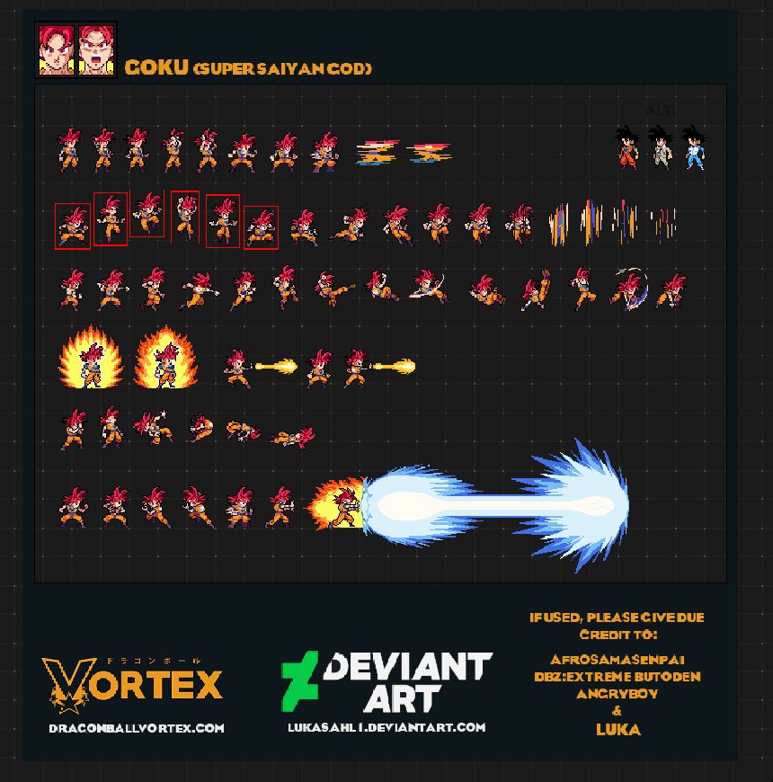
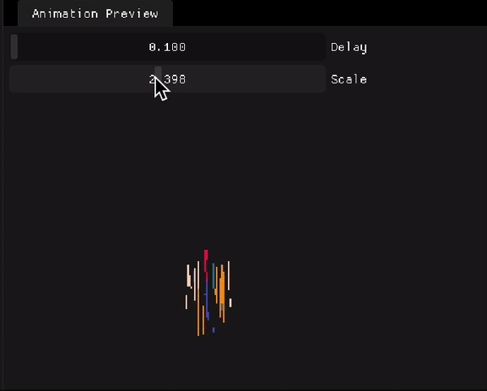
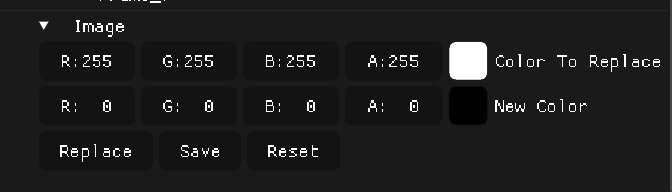

# Spritesheet Editor

This is a spritesheet editor application written in C++ using SFML, OpenCV, ImGUI, and OpenGL. It allows you to slice parts of a spritesheet to create animations that can be previewed. Additionally, it can remove the background color of the sprite.

[](https://youtu.be/rui0Gv-sMmI "Demo Video")

## Features

- Slicing of spritesheets: The application allows you to select a specific portion of the spritesheet to create an animation.
  

- Preview animations: You can preview the animations that you have created to see how they look before exporting.
  

- Remove background color: You can remove the background color of a sprite to make it blend seamlessly with the rest of the game elements.
  

- User-friendly interface: The interface is intuitive and easy to use, making the process of creating animations and editing spritesheets simple.

## Future Plans

- Serialization: The application will be able to serialize data using Protobuffers or Flatbuffers for easier data transfer and storage.
- Docker containerization: I plan to make it possible to use the application as an API in a docker container. This will allow users to send coordinates to the container and receive animations as output.
- Additional functionalities: I plan to add more features to the application to make it even more useful for game developers and designers.
- CRDT and collaborative editing (this is a crazy idea, but it would be cool to have a collaborative spritesheet editor)

## Installation

To run the application, you will need to install the following dependencies:

- SFML
- OpenCV
- ImGUI
- OpenGL

Once you have installed these dependencies, you can clone the repository and compile the code using CMake.

### Technologies Used

This application is built using the following technologies:

- C++ programming language
- SFML library
- OpenCV library
- ImGUI library
- OpenGL graphics library

### Building

You can build the project using CMake. To do so, run the following commands:

```bash
mkdir build
cd build
cmake .. -DCMAKE_BUILD_TYPE=Release -G Ninja -DCMAKE_EXPORT_COMPILE_COMMANDS=ON
ninja
```

`You can use any other build system instead of Ninja. it is just a personal preference.`

The output should be an executable file called `app`. You can run this file to start the application.

## Usage

To use the application, simply run the executable file. You will be presented with a user-friendly interface that will guide you through the process of editing spritesheets and creating animations.

## Contributing

Contributions are welcome! If you would like to contribute to this project, please open an issue or submit a pull request.

## License

This application is licensed under the [MIT License](./LICENSE.md).
